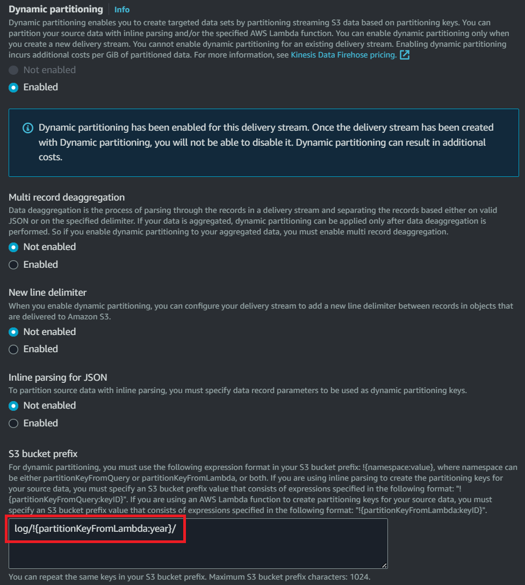

# Transform Records Using Lambda

## Example input data

``` json
{
  "invocationId": "invocationIdExample",
  "deliveryStreamArn": "arn:aws:kinesis:EXAMPLE",
  "region": "us-east-1",
  "records": [
    {
      "recordId": "49546986683135544286507457936321625675700192471156785154",
      "approximateArrivalTimestamp": 1495072949453,
      "data": "eyAgICAidXVpZCI6ICIwZTkyZWI5Ni1iMjU5LTQwZjAtOTEyMi03N2JjZjBmYzAyYjciLCAgICAiZGV2aWNlX3RzIjogIjIwMjMtMDQtMTEgMDc6MzM6MDMuNDY4IiwgICAgImRldmljZV9pZCI6IDQsICAgICJkZXZpY2VfdGVtcCI6IDQwLCAgICAidHJhY2tfaWQiOiAxNCwgICAgICAiYWN0aXZpdHlfdHlwZSI6ICJXYWxraW5nIn0="
    },
    {
      "recordId": "49546986683135544286507457936321625675700192471156785155",
      "approximateArrivalTimestamp": 1495072949453,
      "data": "eyAgICAidXVpZCI6ICJlZjcxNjRmOS0xOTY0LTQ4YzQtYmUwZi01ZDg3NDk2ZmE1MmQiLCAgICAiZGV2aWNlX3RzIjogIjIwMjMtMDQtMTEgMDc6MzM6MDMuNDY4IiwgICAgImRldmljZV9pZCI6IDQzLCAgICAiZGV2aWNlX3RlbXAiOiAyOCwgICAgInRyYWNrX2lkIjogNCwgICAgICAiYWN0aXZpdHlfdHlwZSI6ICJXb3JraW5nIn0="
    },
    {
      "recordId": "49546986683135544286507457936321625675700192471156785156",
      "approximateArrivalTimestamp": 1495072949453,
      "data": "eyAgICAidXVpZCI6ICIyM2RhM2EzNS04ZGJjLTRlODctOTBlYy01MzJmZmY2NTEwMWYiLCAgICAiZGV2aWNlX3RzIjogIjIwMjMtMDQtMTEgMDc6MzM6MDMuNDY4IiwgICAgImRldmljZV9pZCI6IDQwLCAgICAiZGV2aWNlX3RlbXAiOiAyOCwgICAgInRyYWNrX2lkIjogMjgsICAgICAgImFjdGl2aXR5X3R5cGUiOiAiU2l0dGluZyJ9"
    },
    {
      "recordId": "49546986683135544286507457936321625675700192471156785157",
      "approximateArrivalTimestamp": 1495072949453,
      "data": "eyAgICAidXVpZCI6ICI3ZDM5OGNhNS00NjhiLTQ4Y2UtYmE4NC05Mzc0ZmJjMTUwZTUiLCAgICAiZGV2aWNlX3RzIjogIjIwMjMtMDQtMTEgMDc6MzM6MDMuNDY5IiwgICAgImRldmljZV9pZCI6IDQ3LCAgICAiZGV2aWNlX3RlbXAiOiAzMiwgICAgInRyYWNrX2lkIjogMjksICAgICAgImFjdGl2aXR5X3R5cGUiOiAiV29ya2luZyJ9"
    },
    {
      "recordId": "49546986683135544286507457936321625675700192471156785158",
      "approximateArrivalTimestamp": 1495072949453,
      "data": "eyAgICAidXVpZCI6ICJiYzdjNjhmNC01MjBkLTRjYWQtOTcyNC0wMTZkY2Q2ZjQ5YzEiLCAgICAiZGV2aWNlX3RzIjogIjIwMjMtMDQtMTEgMDc6MzM6MDMuNDY5IiwgICAgImRldmljZV9pZCI6IDM1LCAgICAiZGV2aWNlX3RlbXAiOiAzMiwgICAgInRyYWNrX2lkIjogMzAsICAgICAgImFjdGl2aXR5X3R5cGUiOiAiV2Fsa2luZyJ9"
    }
  ]
}
```

## Example output data

``` json
{
  "records": [
    {
      "recordId": "49546986683135544286507457936321625675700192471156785154",
      "result": "Ok",
      "data": "eyJ1dWlkIjogIjBlOTJlYjk2LWIyNTktNDBmMC05MTIyLTc3YmNmMGZjMDJiNyIsICJkZXZpY2VfdHMiOiAiMjAyMy0wNC0xMSAwOTozMzowMy40NjgwMDArMDI6MDAiLCAiZGV2aWNlX2lkIjogNCwgImRldmljZV90ZW1wIjogNDAsICJ0cmFja19pZCI6IDE0LCAiYWN0aXZpdHlfdHlwZSI6ICJXYWxraW5nIn0="
    },
    {
      "recordId": "49546986683135544286507457936321625675700192471156785155",
      "result": "Ok",
      "data": "eyJ1dWlkIjogImVmNzE2NGY5LTE5NjQtNDhjNC1iZTBmLTVkODc0OTZmYTUyZCIsICJkZXZpY2VfdHMiOiAiMjAyMy0wNC0xMSAwOTozMzowMy40NjgwMDArMDI6MDAiLCAiZGV2aWNlX2lkIjogNDMsICJkZXZpY2VfdGVtcCI6IDI4LCAidHJhY2tfaWQiOiA0LCAiYWN0aXZpdHlfdHlwZSI6ICJXb3JraW5nIn0="
    },
    {
      "recordId": "49546986683135544286507457936321625675700192471156785156",
      "result": "Ok",
      "data": "eyJ1dWlkIjogIjIzZGEzYTM1LThkYmMtNGU4Ny05MGVjLTUzMmZmZjY1MTAxZiIsICJkZXZpY2VfdHMiOiAiMjAyMy0wNC0xMSAwOTozMzowMy40NjgwMDArMDI6MDAiLCAiZGV2aWNlX2lkIjogNDAsICJkZXZpY2VfdGVtcCI6IDI4LCAidHJhY2tfaWQiOiAyOCwgImFjdGl2aXR5X3R5cGUiOiAiU2l0dGluZyJ9"
    },
    {
      "recordId": "49546986683135544286507457936321625675700192471156785157",
      "result": "Ok",
      "data": "eyJ1dWlkIjogIjdkMzk4Y2E1LTQ2OGItNDhjZS1iYTg0LTkzNzRmYmMxNTBlNSIsICJkZXZpY2VfdHMiOiAiMjAyMy0wNC0xMSAwOTozMzowMy40NjkwMDArMDI6MDAiLCAiZGV2aWNlX2lkIjogNDcsICJkZXZpY2VfdGVtcCI6IDMyLCAidHJhY2tfaWQiOiAyOSwgImFjdGl2aXR5X3R5cGUiOiAiV29ya2luZyJ9"
    },
    {
      "recordId": "49546986683135544286507457936321625675700192471156785158",
      "result": "Ok",
      "data": "eyJ1dWlkIjogImJjN2M2OGY0LTUyMGQtNGNhZC05NzI0LTAxNmRjZDZmNDljMSIsICJkZXZpY2VfdHMiOiAiMjAyMy0wNC0xMSAwOTozMzowMy40NjkwMDArMDI6MDAiLCAiZGV2aWNlX2lkIjogMzUsICJkZXZpY2VfdGVtcCI6IDMyLCAidHJhY2tfaWQiOiAzMCwgImFjdGl2aXR5X3R5cGUiOiAiV2Fsa2luZyJ9"
    }
  ]
}
```

The possible result values are:

- `Ok`
- `Dropped`
- `ProcessingFailed`

## Example function (transform timezone)

``` python title="lambda_function.py" linenums="1"
import json
import base64
from datetime import datetime, timezone, timedelta

UTC = timezone(timedelta(hours=0))
CEST = timezone(timedelta(hours=2))

def lambda_handler(event, context):
    # print(json.dumps(event, default=str))
    records = event['records']
    new_records = []

    for record in records:
        data = json.loads(base64.b64decode(record['data']).decode())
        data['device_ts'] = datetime.strptime(data['device_ts'], '%Y-%m-%d %H:%M:%S.%f').replace(tzinfo=UTC).astimezone(tz=CEST)
        new_records.append({
            'recordId': record['recordId'],
            'result': 'Ok',
            'data': base64.b64encode((json.dumps(data, default=str) + '\n').encode())   # add new line
        })
    
    # print(new_records)
    return {
        'records': new_records
    }
```

!!! note

    If you want to use dynamic partitioning, you should define partition key like this.

    ``` python
    new_records.append({
        'recordId': record['recordId'],
        'result': 'Ok',
        'data': base64.b64encode((json.dumps(data, default=str) + '\n').encode()),
        'metadata': {
            'partitionKeys': {
                'year': str(data.year)
            }
        }
    })
    ```

    

> This function transform datetime from UTC to CEST.

## Example function (transform GZIP to JSON)

``` python title="lambda_function.py" linenums="1"
import json
import base64
import gzip

def lambda_handler(event, context):
    # print(json.dumps(event, default=str))
    records = event['records']
    new_records = []

    for record in records:
        data = record['data'] # (1)
        decompressed = gzip.decompress(base64.b64decode(data))  # (2)
        result = json.dumps(json.loads(decompressed.decode()))  # (3)
        # print(result)
        new_records.append({
            'recordId': record['recordId'],
            'result': 'Ok',
            'data': base64.b64encode(result.encode())
        })

    # print(new_records)
    return {
        'records': new_records
    }
```

1. H4sIAAAAAAAAA1WNyw6DIBBFf8Ww7jQDDI/yI10aC9gQ09Yompim/17ElXd5ck/Otyljy5ICcw3TD0HCeIQejQTqYwAbUAOXgltPdNPKs0tVQlyTj22ed0+gkIAKkBrkDpWTdFVWnK81Ic1Zj6+xUMKD5qnzw3HkvKICO5/TmvLW5m2Me+3+mYb0frLfH7rzCPC9AAAA
2. b'{ "uuid": "6b2427c0-f073-4fed-8d06-13218c44965c", "device_ts": "2023-05-04 01:05:34.582", "device_id": 37, "device_temp": 40, "track_id": 11, "activity_type": "Working"}'
3. {"uuid": "6b2427c0-f073-4fed-8d06-13218c44965c", "device_ts": "2023-05-04 01:05:34.582", "device_id": 37, "device_temp": 40, "track_id": 11, "activity_type": "Working"}