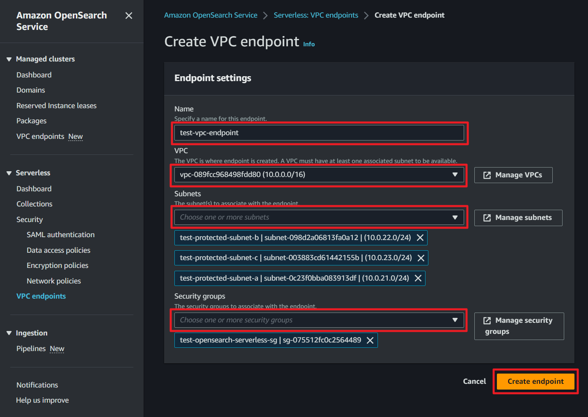
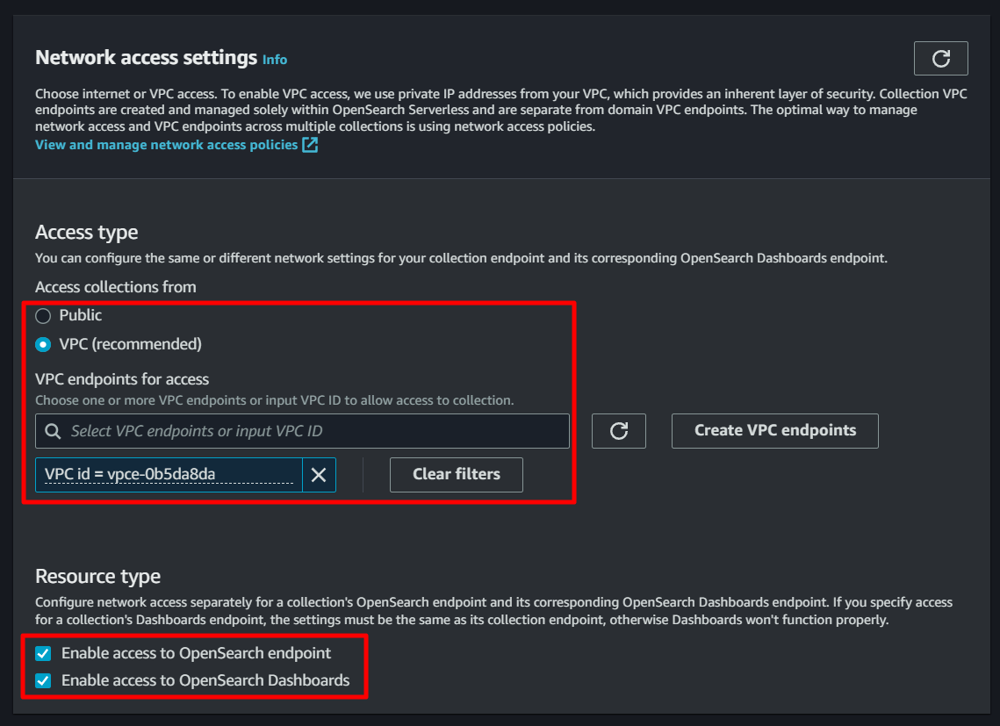

# Delivery to OpenSearch Serverless

## Create OpenSearch Serverless Collection

### Create OpenSeach Serverless VPC Endpoint

Choose private or protected subnet and collection's security group.

### Create OpenSearch Serverless Collection

Type the correct collection name and type.

Choose KMS key type.

Choose the VPC endpoint which you created in [here](#create-openseach-serverless-vpc-endpoint).

