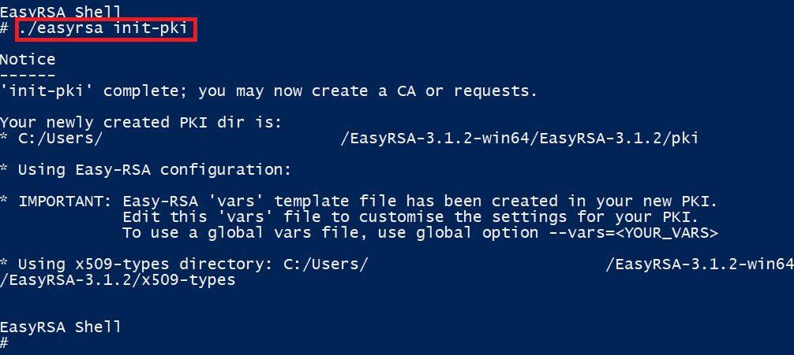
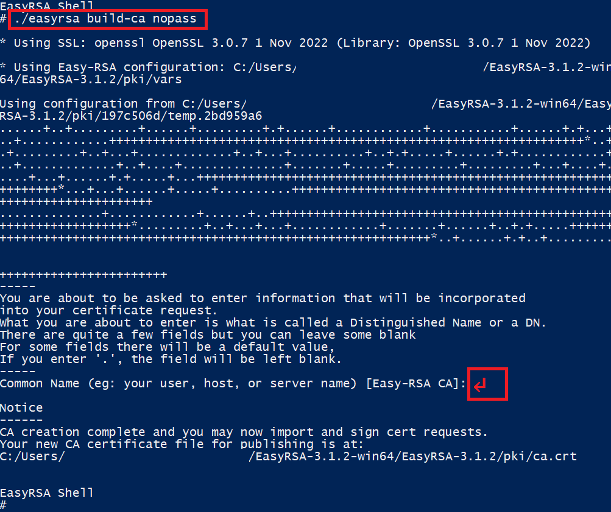

# Create Client VPN

## Create certificates

=== ":simple-linux: Linux"

    ``` bash hl_lines="1 2"
    PROJECT_NAME="<project name>"
    REGION="<region code>"

    sudo yum update -y
    sudo yum install -y git

    git clone https://github.com/OpenVPN/easy-rsa.git
    cd easy-rsa/easyrsa3

    export EASYRSA_BATCH=1

    ./easyrsa init-pki
    ./easyrsa build-ca nopass
    ./easyrsa build-server-full server nopass
    ./easyrsa build-client-full client1.domain.tld nopass

    mkdir ~/vpn-certs/
    cp pki/ca.crt ~/vpn-certs/
    cp pki/issued/server.crt ~/vpn-certs/
    cp pki/private/server.key ~/vpn-certs/
    cp pki/issued/client1.domain.tld.crt ~/vpn-certs
    cp pki/private/client1.domain.tld.key ~/vpn-certs/
    cd ~/vpn-certs/

    aws acm import-certificate \
        --certificate fileb://server.crt \
        --private-key fileb://server.key \
        --certificate-chain fileb://ca.crt \
        --tags Key=project,Value=$PROJECT_NAME \
        --region $REGION
    
    aws acm import-certificate \
        --certificate fileb://client1.domain.tld.crt \
        --private-key fileb://client1.domain.tld.key \
        --certificate-chain fileb://ca.crt \
        --tags Key=project,Value=$PROJECT_NAME \
        --region $REGION
    ```

=== ":simple-windows: Windows"

    ### Install EasyRSA

    ``` powershell
    curl.exe -LO https://github.com/OpenVPN/easy-rsa/releases/download/v3.1.2/EasyRSA-3.1.2-win64.zip
    Expand-Archive ./EasyRSA-3.1.2-win64.zip
    cd ./EasyRSA-3.1.2-win64/EasyRSA-3.1.2
    ./EasyRSA-Start.bat
    ```

    ### Initialize a new PKI environment

    ``` powershell
    ./easyrsa init-pki
    ```

    

    ### Build a new CA

    ``` powershell
    ./easyrsa build-ca nopass
    ```

    

    ### Generate the server certificate and key

    ``` powershell
    ./easyrsa build-server-full server nopass
    ```

    

    ### Generate the client certificate and key

    ``` powershell
    ./easyrsa build-client-full client1.domain.tld nopass
    ```

    

    ### Exit the EasyRSA 3 shell

    ``` powershell
    exit
    ```

    ### Copy the certificates and keys

    ``` powershell
    mkdir ../../vpn-certs
    cp pki/ca.crt ../../vpn-certs/
    cp pki/issued/server.crt ../../vpn-certs/
    cp pki/private/server.key ../../vpn-certs/
    cp pki/issued/client1.domain.tld.crt ../../vpn-certs
    cp pki/private/client1.domain.tld.key ../../vpn-certs/
    cd ../../vpn-certs/
    ```

    ### Upload the certificates and keys

    ``` powershell hl_lines="1 2"
    $PROJECT_NAME="<project name>"
    $REGION="<region code>"

    aws acm import-certificate `
        --certificate fileb://server.crt `
        --private-key fileb://server.key `
        --certificate-chain fileb://ca.crt `
        --tags Key=project,Value=$PROJECT_NAME `
        --region $REGION
    
    aws acm import-certificate `
        --certificate fileb://client1.domain.tld.crt `
        --private-key fileb://client1.domain.tld.key `
        --certificate-chain fileb://ca.crt `
        --tags Key=project,Value=$PROJECT_NAME `
        --region $REGION
    ```

[AWS Documentation](https://docs.aws.amazon.com/vpn/latest/clientvpn-admin/client-authentication.html#mutual)

## Create Client VPN using Cloudformation

=== ":simple-linux: Linux"

    ``` bash hl_lines="1 2 3 6 9 10 13 14 15 18 19"
    STACK_NAME="<stack name>"
    PROJECT_NAME="<project name>"
    REGION="<region code>"

    # VPN Configuration - General
    ClientVpnName=""                  # [REQUIRED] The name of client vpn.

    # VPN Configuration - Certificate
    ServerCertificateArn=""           # [REQUIRED] The arn of server certification in ACM.
    ClientCertificateArn=""           # [REQUIRED] The arn of client certification in ACM.

    # VPN Configuration - Client
    ClientCidrBlock=""                # [REQUIRED] The IP address range, in CIDR notation, from which client IP addresses are allocated. (/12 ~ /22)
    SecurityGroupId=""                # [REQUIRED] The id of security group.
    TaragetNetworkCidr="10.0.0.0/16"  # [REQUIRED] The CIDR of the network for which access is being authorized.

    # VPN Configuration - VPC
    VpcId=""                          # [REQUIRED] The id of VPC.
    SubnetIds=""                      # [REQUIRED] The id list of subnets.

    curl -L -o client-vpn.yaml https://raw.githubusercontent.com/marcus16-kang/cloudformation-templates/main/vpc/client-vpn/template.yaml

    aws cloudformation deploy \
        --stack-name $STACK_NAME \
        --template-file ./client-vpn.yaml \
        --parameter-overrides \
            ProjectName=$PROJECT_NAME \
            ClientVpnName=$ClientVpnName \
            ServerCertificateArn=$ServerCertificateArn \
            ClientCertificateArn=$ClientCertificateArn \
            ClientCidrBlock=$ClientCidrBlock \
            SecurityGroupId=$SecurityGroupId \
            TaragetNetworkCidr=$TaragetNetworkCidr \
            VpcId=$VpcId \
            SubnetIds=$SubnetIds \
        --tags project=$PROJECT_NAME \
        --region $REGION \
        --disable-rollback
    
    aws cloudformation describe-stacks \
        --stack-name $STACK_NAME \
        --query "Stacks[0].Outputs[0].OutputValue" \
        --region $REGION \
        --output text
    ```

=== ":simple-windows: Windows"

    ``` powershell hl_lines="1 2 3 6 9 10 13 14 15 18 19"
    $STACK_NAME="<stack name>"
    $PROJECT_NAME="<project name>"
    $REGION="<region code>"

    # VPN Configuration - General
    $ClientVpnName=""                 # [REQUIRED] The name of client vpn.

    # VPN Configuration - Certificate
    $ServerCertificateArn=""          # [REQUIRED] The arn of server certification in ACM.
    $ClientCertificateArn=""          # [REQUIRED] The arn of client certification in ACM.

    # VPN Configuration - Client
    $ClientCidrBlock=""               # [REQUIRED] The IP address range, in CIDR notation, from which client IP addresses are allocated. (/12 ~ /22)
    $SecurityGroupId=""               # [REQUIRED] The id of security group.
    $TaragetNetworkCidr="10.0.0.0/16" # [REQUIRED] The CIDR of the network for which access is being authorized.

    # VPN Configuration - VPC
    $VpcId=""                         # [REQUIRED] The id of VPC.
    $SubnetIds=""                     # [REQUIRED] The id list of subnets.

    curl.exe -L -o client-vpn.yaml https://raw.githubusercontent.com/marcus16-kang/cloudformation-templates/main/vpc/client-vpn/template.yaml

    aws cloudformation deploy `
        --stack-name $STACK_NAME `
        --template-file ./client-vpn.yaml `
        --parameter-overrides `
            ProjectName=$PROJECT_NAME `
            ClientVpnName=$ClientVpnName `
            ServerCertificateArn=$ServerCertificateArn `
            ClientCertificateArn=$ClientCertificateArn `
            ClientCidrBlock=$ClientCidrBlock `
            SecurityGroupId=$SecurityGroupId `
            TaragetNetworkCidr=$TaragetNetworkCidr `
            VpcId=$VpcId `
            SubnetIds=$SubnetIds `
        --tags project=$PROJECT_NAME `
        --region $REGION `
        --disable-rollback
    
    aws cloudformation describe-stacks `
        --stack-name $STACK_NAME `
        --query "Stacks[0].Outputs[0].OutputValue" `
        --region $REGION `
        --output text
    ```

## Create OpenVPN configuration file

=== ":simple-linux: Linux"

    ``` bash hl_lines="1 2"
    CLIENT_VPN_ENDPOINT_ID="<endpoint id>"
    REGION="<region code>"

    cd ~

    aws ec2 export-client-vpn-client-configuration \
        --client-vpn-endpoint-id $CLIENT_VPN_ENDPOINT_ID \
        --region $REGION \
        --output text > client-config.ovpn

    sed -i '34 i<cert>\n</cert>\n<key>\n</key>' client-config.ovpn
    sed -i "/<cert>/r /home/ec2-user/vpn-certs/client1.domain.tld.crt" client-config.ovpn
    sed -i "/<key>/r /home/ec2-user/vpn-certs/client1.domain.tld.key" client-config.ovpn
    ```

=== ":simple-windows: Windows"

    ``` powershell hl_lines="1 2"
    $CLIENT_VPN_ENDPOINT_ID="<endpoint id>"
    $REGION="<region code>"

    cd ../

    aws ec2 export-client-vpn-client-configuration `
        --client-vpn-endpoint-id $CLIENT_VPN_ENDPOINT_ID `
        --region $REGION `
        --output text > client-config.ovpn
    
    $CLIENT_CERT_FULLNAME=(Get-Item "./vpn-certs/client1.domain.tld.crt").FullName
    $CLIENT_KEY_FULLNAME=(Get-Item "./vpn-certs/client1.domain.tld.key").FullName

    (Get-Content client-config.ovpn) |
        Foreach-Object {
            if ($_ -match "^remote ") {
                "<cert>`n</cert>`n<key>`n</key>`n" + $_
            } else {
                $_
            }
        } | Set-Content client-config.ovpn

    (Get-Content client-config.ovpn) |
        Foreach-Object {
            if ($_ -match "<cert>") {
                $_
                Get-Content $CLIENT_CERT_FULLNAME
            } else {
                $_
            }
        } | Set-Content client-config.ovpn

    (Get-Content client-config.ovpn) |
        Foreach-Object {
            if ($_ -match "<key>") {
                $_
                Get-Content $CLIENT_KEY_FULLNAME
            } else {
                $_
            }
        } | Set-Content client-config.ovpn
    ```

[AWS Documentation](https://docs.aws.amazon.com/vpn/latest/clientvpn-admin/cvpn-working-endpoint-export.html)

## Download AWS Provided Client

[Download Here](https://aws.amazon.com/ko/vpn/client-vpn-download/)